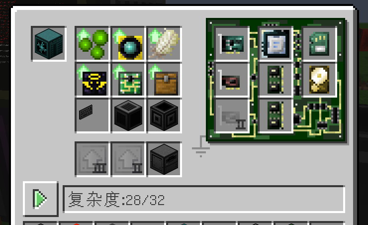
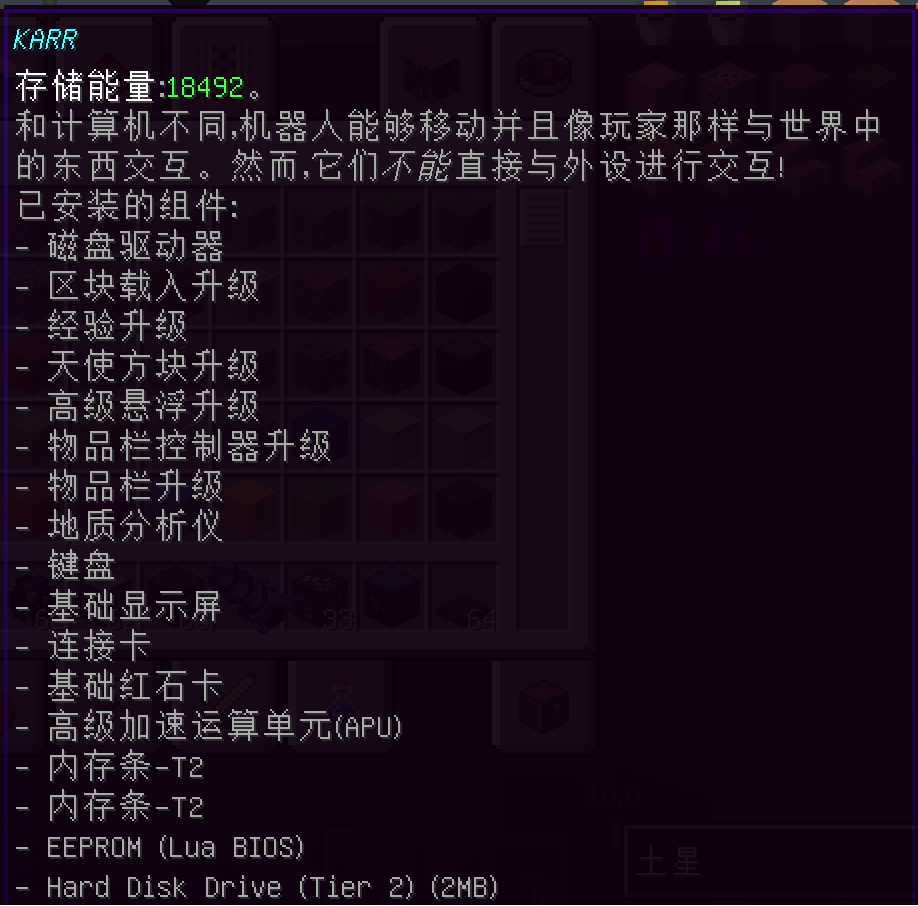
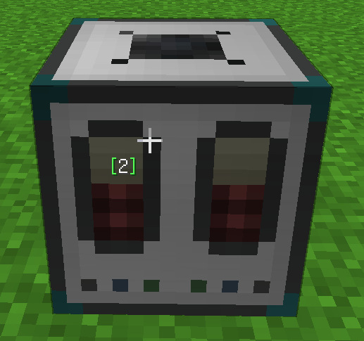
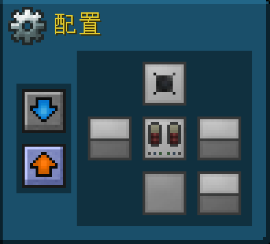

# 鸽子号OC自动挖矿机器人说明书

## 一、机器人配置

### 1. 机器人构成

 

 

### 2. 机器人物品

 

从左向右注意：

1. 矿物末影箱子

2. 装有能量框架的末影箱子，请保证内部有足够的满电能量框架，**设置为上面输出！！**

3. 能量灌注器，请保证等级足够为电钻充电，**并确保无自动输入输出，上表面设置为允许输入输出**，如图

 

 

4. 充电器

5. 设置为1*1的电钻

### 3. 软件配置

装入auto_miner.lua 和 auto_miner.cfg

到达需要开始挖矿的位面（必须为ep星球）

edit auto_miner.cfg 修改矿机位置和矿物位置参数

**一定要正确设置初始位置和挖矿平均深度，上下搜索深度！！！！**

执行auto_miner开始挖矿

## 二、管理端配置

安装miner_controller.lua

安装对应机器人的连接卡（此卡可铁砧命名为机器人名字+所去星球， 方便后续使用）

执行miner_controller，程序会在后台监控

机器人发回位置信息和地牢信息将自动在目录下生成Log

通过连接卡发送back!可以召回机器人

 当然现在除了召回功能，其他都有bug，不要当真……

